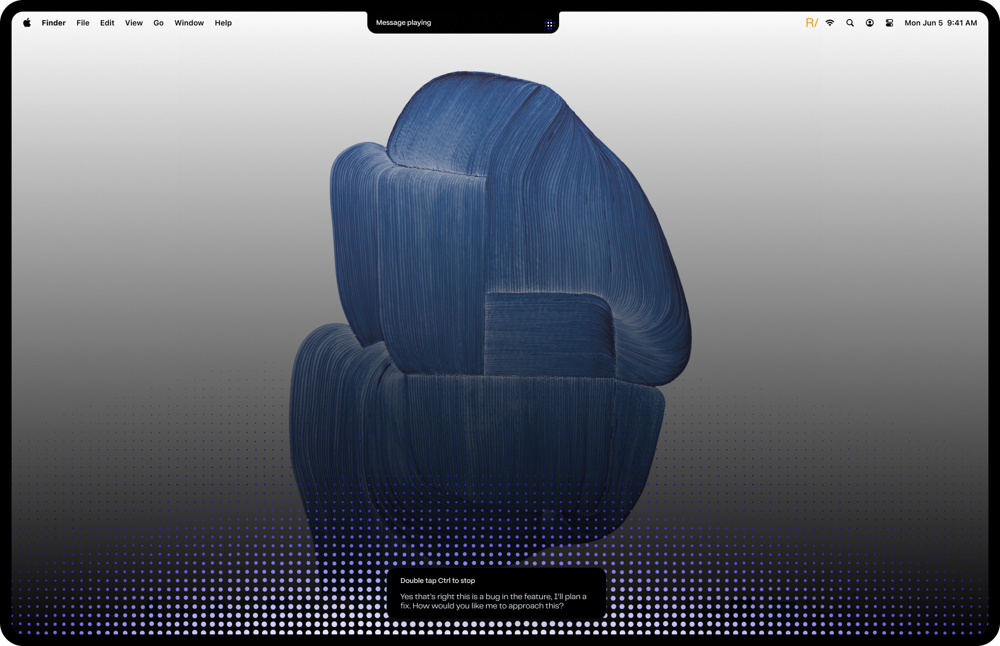
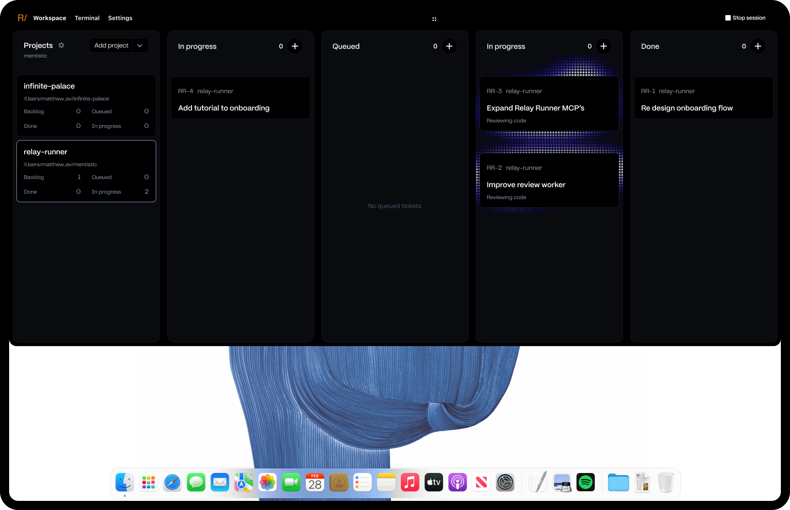

## Description

Bring Relay Runner's already-public repository to a polished open-source release
standard. A new visitor should quickly understand what the product does, see it
in use, decide whether it fits their workflow, install or build it, trust its
privacy claims, and find deeper technical and contribution documentation.

Use [Block's Buzz README](https://github.com/block/buzz#readme) as the editorial
and structural reference, not as a visual or copywriting template. Match its
clarity and progressive disclosure: lead with a concise product promise and a
strong visual, explain user outcomes before implementation details, show the
product in context, state current limitations honestly, provide clear setup
paths, then link to deeper architecture and project documentation.

The README should retain Relay Runner's own voice and explain its two connected
experiences:

- a native macOS voice layer for Codex and Claude, with local speech processing,
  unobtrusive listening/playback feedback, and optional Relay Actions and Relay
  Vision capabilities; and
- Workspace, where users select local projects, start project-scoped sessions,
  create and inspect Relay tickets, and follow orchestrator and worker progress.

Keep operational reference material available, but move long configuration,
architecture, troubleshooting, testing, and release details into clearly linked
documents where that makes the primary README easier to scan.

## README direction

- Open with a centered Relay Runner name, a one-sentence value proposition, and
  a small set of useful navigation links.
- Use the message-playing screenshot as the primary visual near the top of the
  README, followed later by a short product tour that includes Workspace.
- Organize the narrative around questions a new user has: what Relay Runner is,
  what they can do with it, what is local or shared with a provider, what works
  today, how to install it, and how the system is put together.
- Prefer short, conversational sections, descriptive headings, captions, and
  outcome-led bullets over a wall of settings and implementation details.
- Include an honest current-state section that distinguishes shipped behavior,
  optional capabilities, known limitations, and work that is still evolving.
- Give signed-release installation and build-from-source users separate,
  unambiguous paths, including the first-run onboarding and permission flow.
- End with concise contribution, security, support, license, and acknowledgment
  routes rather than embedding policy documents or the full license in README.

## Reference images

- 
- 

Before promoting either source image into a public README asset, inspect it for
personal filesystem paths, unrelated project names, or other identifying data;
crop or redact those details while preserving the product UI and legibility.

## Scope boundaries

- Do not change repository visibility, create a tag or release, publish an
  update feed, or make an external announcement as part of this ticket.
- Do not invent feature claims or imply provider, permission, or privacy
  behavior that the current app and release artifacts do not support.
- Preserve the existing build and release pipeline rather than introducing a
  second packaging or publication path.
- Keep Codex and Claude documentation intentionally equivalent where behavior
  is shared, and call out real provider-specific setup or limitations.

## Acceptance criteria

- [x] The README follows the product-led structure above and uses Buzz as a quality reference without copying Buzz branding, prose, screenshots, or project-specific sections.
- [x] The opening communicates Relay Runner's value in one sentence, provides a small set of working navigation links, and shows the supplied message-playing image as the primary visual.
- [x] A concise product-tour section uses the supplied Workspace image and explains project selection, project-scoped sessions, tickets, orchestration, and worker progress in user-facing language.
- [x] Public copies of both supplied images use stable repository-relative paths, descriptive alt text and captions, retain readable UI, and expose no personal filesystem paths or unrelated identifying data.
- [x] The README explains what audio and text stay local, what reaches Codex or Claude, and why each optional macOS permission is requested without overstating privacy or security guarantees.
- [x] Shipped behavior, optional Relay Actions and Relay Vision capabilities, known limitations, and evolving or experimental work are clearly distinguished.
- [x] Signed-release installation and build-from-source instructions are separately testable and accurately cover requirements, first-run onboarding, model/bootstrap downloads, permissions, and the supported session entry points.
- [x] Codex and Claude setup, authentication, model and effort choices, permissions, supported workflows, and provider-specific limitations are accurate and intentionally parallel.
- [x] The README contains a concise current architecture overview and links to maintained deeper documentation for orchestration, project scope and registry, artifacts, Relay Actions, Relay Vision, testing, troubleshooting, and releases.
- [x] Standalone license, contribution, security-reporting, support, conduct, testing, and release guidance exists at an appropriate level for an early project and is linked from the README; the full license text is not duplicated there.
- [x] Source, documentation, fonts, icons, models, bundled services, third-party packages, and release artifacts have compatible and documented licensing and attribution.
- [x] Repository history and current files are audited for credentials, private endpoints, personal data, machine-specific paths, and unintended local artifacts, with explicit remediation or a documented retention decision for tracked internal ticket and verification history.
- [x] A clean checkout passes every build, test, and preflight path documented for contributors, and the commands match the current supported toolchain.
- [x] The public default branch, repository links, tags, release assets, version metadata, update feed, and release instructions are internally consistent with the current shipped release.
- [x] No repository visibility change, tag, release, update-feed publication, or external announcement occurs as part of this ticket.

## Run log

- **Run 13** (attempt 3) — branch `relay/rr-174`
  - Restored the preserved run 11 public-release implementation, then corrected the signed-release Apple Silicon requirement and identified the source repository as public in release guidance.
  - Added focused regression assertions; verified 6 documentation tests, 698 Swift tests (3 skipped), and 563 Python tests with no failures. The preserved implementation also carries run 11's successful DMG/ZIP packaging, signing, embedded-notice, and checksum evidence.
  - Done with no unresolved follow-up; no visibility, tag, release, update-feed, install, or announcement action was performed.
