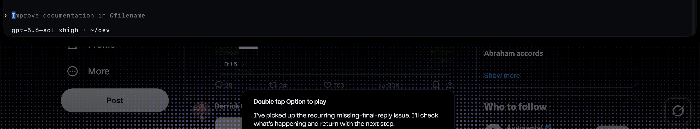

## Description

Investigate and fix a foreground reply regression that remains after RR-210.
The user still receives the missing-final warning even when Relay has a
nonempty response available for deferred playback. In the same session, the
integrated provider terminal displays prompt text in its idle input row that
the user did not type.

Recent back-to-back voice turns also exposed a correlation hazard: more than
one Relay command can reach the foreground session before the earlier turn has
finished, while the completion hook binds only an exact match for the current
claimed prompt. Determine the actual event and PTY-write ordering rather than
assuming a single cause. Prevent prompt writes, submits, claim publication, and
provider completion records from mixing across turns.

Also determine who owns the unsolicited idle-row text. If Relay writes it,
remove that write path. If it is a provider-owned suggestion or placeholder,
prove that Relay neither inserts nor submits it and preserve the provider's
normal behavior without misclassifying it as a voice command.

Keep diagnostics sanitized. Do not log or persist raw voice transcripts,
provider prompts, completion text, terminal contents, secrets, or hook
payloads.

## Acceptance criteria

- [x] A focused reproduction covers two voice commands arriving close together while the first provider turn is still active.
- [x] Each Relay voice command produces one complete foreground prompt write and one submit event; commands are never concatenated, partially interleaved, duplicated, or submitted from stale state.
- [x] Claim metadata is published atomically before the matching submit, and `UserPromptSubmit` binds the exact prompt that was actually delivered for that turn.
- [x] A matching provider `Stop` with a nonempty final routes that final exactly once through the authoritative reply path and suppresses the missing-final warning.
- [x] A newer voice command may preempt stale work without corrupting the new prompt, combining terminal input, or speaking the superseded final.
- [x] An explicit current reply continues to deduplicate a later completion-hook recovery.
- [x] The source of unsolicited idle input-row text is verified from PTY write instrumentation: Relay-authored text is eliminated, while provider-owned suggestion text is never claimed or submitted by Relay.
- [x] Ordinary typed turns, provider-owned placeholders, sub-agent completions, and terminal scrollback are excluded from Relay speech and command correlation.
- [x] Completion-hook failure, empty finals, provider interruption, bridge unavailability, and session shutdown retain one bounded warning only after the relevant turn has actually completed.
- [x] Sanitized diagnostics identify event type, provider, turn correlation, and ordering without recording raw user or provider content.
- [x] Codex and Claude both pass equivalent rapid-turn, stale-command, nonempty-final, explicit-reply deduplication, and idle-input ownership tests.
- [x] Relevant Python and Swift suites pass, including completion-hook, voice preemption, embedded terminal delivery, provider launch, messenger routing, and app-managed session lifecycle coverage.

## Attachments

- 

The user-provided screenshot is cropped to retain the reported idle input and
available response while excluding the raw Relay command transcript.

## Run log

### Run 304 (attempt 2) — branch `relay/rr-211`

- Serialized app-owned PTY delivery so Relay never claims a second command while a prompt submit is pending, drops stale ready files before writing text, clears stale pre-submit prompt text, and defers normal commands while a provider turn is active; interrupts still bypass the active-turn wait.
- Hardened completion/fallback correlation so missing-final warnings wait for pending delivery or active provider turns, nonempty current `Stop` finals remain deduped through the authoritative reply path, ambiguous no-turn-id completions are not guessed, and provider placeholder text is ignored.
- Added bounded sanitized PTY delivery diagnostics with event/order/provider/relay ids only, included the diagnostic file in session cleanup, and verified with Python and Swift regression suites.

No unresolved follow-ups. Status: done.
