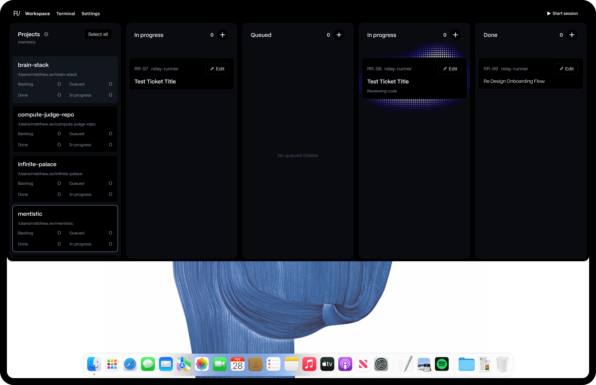

## Description

Represent an agent actively working on a ticket with an animated dot-matrix
glow behind that ticket's card in Workspace. This is not an outline halo.

Match the attached design: the active card remains a solid, legible black
surface while a soft blue-purple field of animated dots is visible behind and
beyond its edges.

Use the exact existing `ParticleFieldRenderer` animation from the STT/TTS
overlays. The dots' grid, spacing, size modulation, palette, highlights,
intensity, wave movement, and timing must remain unchanged. The attached
reference uses the blue-purple TTS theme.

The only new visual behavior is the field's spatial shape. Reveal the shared
particle animation through a localized mask that continuously morphs and
undulates like metaballs: rounded lobes should expand, merge, pinch, and
separate fluidly behind the card. It must not resolve into a static halo,
radial ring, rectangular gradient, or simple opacity pulse. Share the real
renderer and vary only its mask; do not create a second lookalike particle
animation.

Drive the effect from authoritative worker activity, not lane placement alone.
An item should glow only while `ProgramStatusItem.hasActiveWorker` is true.
Tickets that are merely in the In progress lane but are awaiting review,
stalled, failed, canceled, or no longer owned by a live worker must not keep
the active animation.

## Acceptance criteria

- [ ] A ticket with `hasActiveWorker == true` renders the attached design's animated blue-purple dot-matrix glow behind its card.
- [ ] The underlying dots use the exact shared STT/TTS particle animation, including grid spacing, radius modulation, TTS palette and highlight, intensity, wave movement, and timing.
- [ ] Given the same theme, intensity, size, and animation timestamp, the ticket treatment produces the same underlying particle frame as the existing overlay before its localized mask is applied.
- [ ] The only ticket-specific visual transformation is a localized, continuously evolving spatial mask; no separate hard-coded dot renderer, copied palette, altered wave, or alternate particle timing is introduced.
- [ ] The mask morphs like metaballs, with smooth lobes that continuously expand, merge, pinch, separate, and undulate without a visible loop seam.
- [ ] The result never reads as a static halo, outline, radial ring, fixed rectangle, or simple pulsing glow.
- [ ] The opaque ticket card and all text, badges, activity copy, buttons, hover states, and selection states remain legible and interactive above the effect.
- [ ] The morphing dot field remains clipped to the owning work column and never overlaps neighboring columns or obscures another card.
- [ ] The effect begins when authoritative run state becomes active and fades out promptly when the worker leaves the active state.
- [ ] Awaiting-review, stalled, failed, canceled, queued, backlog, and done tickets do not animate solely because they appear in or previously occupied the In progress lane.
- [ ] Multiple simultaneously active tickets each receive the treatment without shared-state flicker, incorrect card association, or one card stopping another card's animation.
- [ ] Scrolling, rapid status refreshes, selection, editing, and drag behavior do not leave orphaned particle layers, duplicate render loops, or stale glows attached to reused cards.
- [ ] Closing Workspace or moving all active cards off screen suspends unnecessary rendering, and the implementation avoids an independent high-frequency timer per visible card.
- [ ] Single-project and Program Workspace routes use the same active-card treatment.
- [ ] Accessibility exposes the existing active-worker state without adding noisy announcements for animation frames.
- [ ] Automated tests cover exact shared-frame reuse, metaball mask evolution, active versus lane-only state, fade lifecycle, multiple active cards, refresh and reuse cleanup, clipping, and renderer suspension.
- [ ] Visual verification compares the implemented active card with the attached reference at supported Workspace sizes and backing scales.

## Attachments

- 
