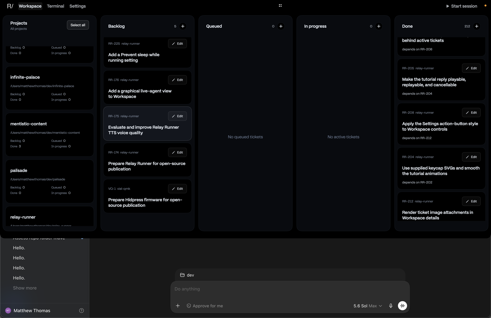

## Description

Fix the Program Workspace ticket lanes so each list can return to its true top
endpoint. On current `main`, after the RR-214 endpoint work and RR-220 scope
reset, the live all-project Workspace still shows a lane at its apparent
minimum offset with the first ticket clipped above the viewport. In the
attached screenshot, the Done lane begins partway through its first card while
the lane header remains fixed.

Treat this as a recurrence of RR-214 and RR-220. Reproduce the failure in the
real `ProgramWorkColumnPanel` / `ProgramColumnTicketScrollView` hierarchy with
live-style, variable-height ticket cards and enough items to match the Done
lane. Identify why the existing fixture tests do not model the failing runtime
layout or input path. Correct the smallest responsible part of the
AppKit-backed scroll container or SwiftUI lane layout; do not add another
scope-only reset unless it addresses the demonstrated stable-scope failure.

Preserve independent per-lane offsets, fixed headers, the reachable bottom
endpoint, drag-and-drop, selection, editing, and empty-lane presentation.

## Acceptance criteria

- [ ] On opening the all-project Program Workspace, Backlog, Queued, In progress, and Done can each reach a minimum offset where the first ticket card is fully visible below its fixed lane header and intended top inset.
- [ ] The attached live layout is reproduced by an automated regression test that fails before the fix; the test renders the real lane hierarchy or otherwise captures the missing runtime geometry/input behavior rather than relying only on generic rectangle fixtures.
- [ ] A Done lane with hundreds of variable-height tickets and a short populated lane have the same correct top endpoint.
- [ ] Trackpad or mouse-wheel scrolling, keyboard scrolling, and the custom scroll thumb all reach the same minimum offset, with the thumb at the visual top of its track.
- [ ] Refreshing or reordering tickets while the project scope remains unchanged cannot preserve or create an invalid positive minimum offset that clips a prepended or first ticket.
- [ ] Switching project scope, changing Workspace tabs, and closing and reopening Workspace do not restore a clipped top position.
- [ ] Scrolling one lane does not change another lane's offset.
- [ ] The final ticket remains fully reachable above the intended bottom inset, and short or empty lanes stay top-aligned without artificial scrolling or blank overscroll.
- [ ] Focused scroll-view tests and the full Swift test suite pass.
- [ ] Manual verification against live Program Workspace data confirms the first Done card is complete at the top.

## Attachments

- 
