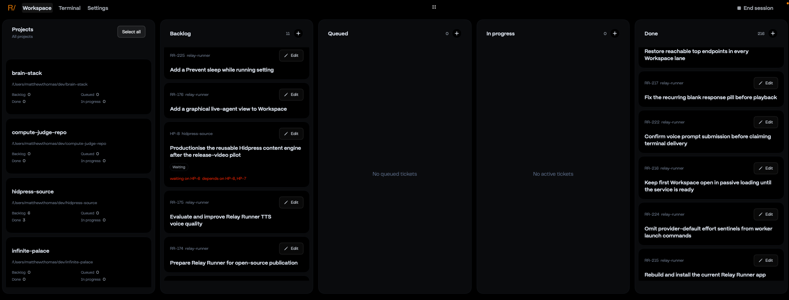

## Description

The Program Workspace ticket lanes still cannot reach their true top endpoint
through manual scrolling in the current installed build containing RR-227. In
live evidence, the Done lane stops at its apparent minimum while the first
ticket's identity and edit row remain clipped beneath the fixed lane header.

RR-220 resets lane offsets when project scope changes, and RR-227 adds another
reset when the top ticket identity changes. Those fixes do not establish that
stable content can reach the correct endpoint through trackpad or mouse-wheel
input. The RR-227 regression test updates the model and checks the clip view's
`documentVisibleRect.minY`, but it does not assert the actual first-card frame
after manually scrolling an unchanged lane.

Reproduce the failure in the real `ProgramWorkColumnPanel` /
`ProgramColumnTicketScrollView` hierarchy using `BoardOverlayScrollContainer`,
live-style variable-height cards, and a faithful manual input path. Fix the
smallest responsible bounds, layout, or event-handling behavior. Do not add
another content-identity reset unless it directly fixes the demonstrated
stable-content input failure.

## Acceptance criteria

- [ ] A regression test fails on current `main` by reproducing the clipped
      first card in a stable-scope, stable-content Workspace lane.
- [ ] The regression exercises trackpad or mouse-wheel scrolling through the
      actual AppKit scroll path, or a faithful event-level equivalent, instead
      of correcting the offset only through model replacement.
- [ ] The test asserts that the actual first ticket card is fully visible below
      the fixed header and intended top inset; checking only
      `documentVisibleRect.minY` is insufficient.
- [ ] Trackpad, mouse wheel, keyboard scrolling, and the custom thumb reach the
      same minimum offset, with the thumb at the visual top of its track.
- [ ] Backlog and Done lanes both reach a complete first card with live-style
      short and long lists, including a Done lane with hundreds of
      variable-height tickets.
- [ ] Independent lane offsets remain independent during scrolling, refresh,
      reorder, scope changes, and newly prepended tickets.
- [ ] The bottom endpoint remains reachable, and short or empty lanes stay
      top-aligned without artificial scrolling or blank overscroll.
- [ ] Focused scroll-view tests and the full Swift test suite pass.
- [ ] Review includes live verification in a freshly built Workspace that the
      first Backlog and Done cards are complete after manual scrolling to the
      top.

## Attachments

- 
