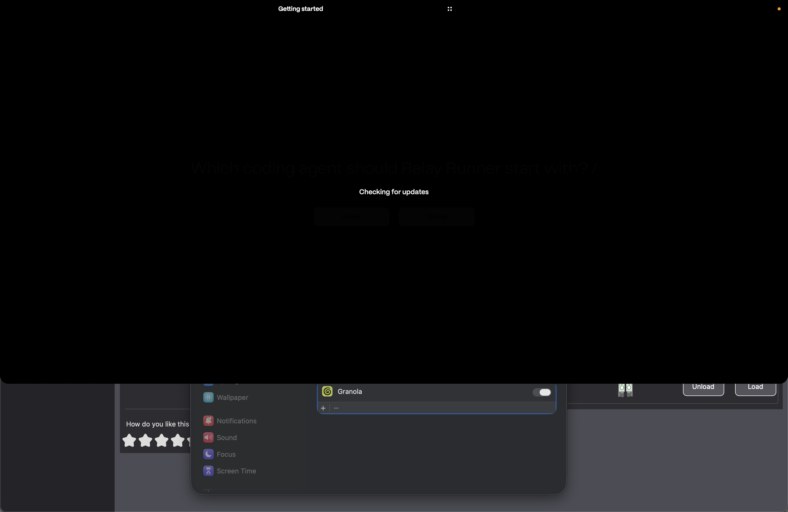

## Description

Fix the first-run onboarding failure shown in the attached screenshot. During
the Codex/Claude choice prompt, a second full-screen reveal surface labeled
**Checking for updates** can appear above onboarding, dim both provider buttons,
and remain stuck indefinitely.

The label is `BoardUpdateStatus.workingLabel`, rendered by the Workspace
`BoardRevealSurfaceView`; this is not Sparkle's software-update UI. The reported
reproduction follows a clean reinstall launched from Relay Runner's embedded
session. That workflow intentionally preserves the hosting app process, resets
the orchestrator launch agent, and starts a second app instance for first-run
onboarding.

Two current behaviors appear to combine:

1. Ordinary Workspace access is gated by the in-memory
   `isFirstRunExperienceActive` value. A preserved app instance does not learn
   that the new instance owns a shared `.onboarding-started` flow, so its
   Workspace surface can still be presented above the new onboarding panel.
2. With the orchestrator daemon absent, the Workspace dashboard's connection
   retry schedule lasts longer than the ten-second status poll. Each poll
   cancels and replaces the in-flight first-load task, preventing it from
   exhausting retries and clearing the blocking reveal.

Verify these causes and implement the smallest robust fix. While any Relay
Runner instance is in incomplete first-run or manual-redo onboarding, ordinary
Workspace entry points from every instance must remain suppressed. Preserve the
explicit session-controls tutorial step that intentionally asks the user to
open Workspace. A Workspace load that is legitimately started while its daemon
is unavailable must also settle into a visible, dismissible failure state
within a bounded time rather than displaying a permanent loading surface.

Do not redesign onboarding, Workspace, the clean-install helper, or provider
setup. Preserve normal Workspace refresh behavior after onboarding completes.

## Acceptance criteria

- [ ] During fresh first-run and manual-redo onboarding, the Codex/Claude
      choice remains visible, clickable, and unobscured by an ordinary
      Workspace reveal from either the onboarding instance or a preserved
      embedded-session instance.
- [ ] Selecting Codex advances through the existing Codex setup path, and
      selecting Claude advances through the existing Claude setup path.
- [ ] The explicit onboarding tutorial Workspace gesture remains allowed and
      continues to advance that tutorial.
- [ ] If a Workspace first load starts while the orchestrator daemon is absent
      or unreachable, **Checking for updates** clears within a bounded time and
      the user receives an actionable, dismissible failure state.
- [ ] Periodic status polling does not repeatedly cancel and restart a slower
      in-flight dashboard load, and cancellation/hide paths always clear the
      loading presentation.
- [ ] After onboarding finishes, ordinary Workspace gestures, notch clicks,
      menu actions, and refresh polling behave as before.
- [ ] Regression tests cover shared on-disk onboarding state across app
      instances, the tutorial-only bypass, and a dashboard retry duration that
      exceeds the polling interval.
- [ ] Relevant focused Swift tests and the full `swift test` suite pass.

## Attachments

- 
