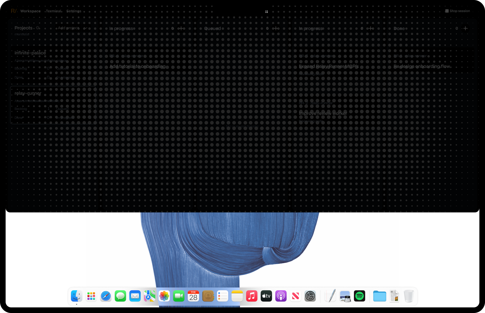
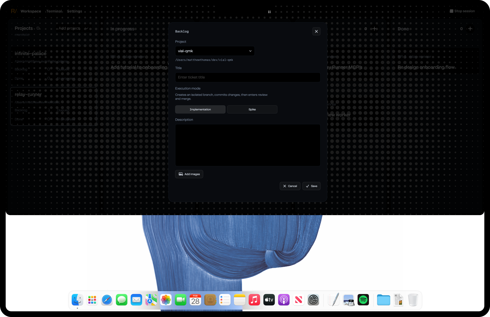

## Description

Add a neutral dot-matrix treatment to the expanded Workspace notch for modal presentations and generic loading states. It should visually match the supplied references: a grey dot field covers the entire black Workspace/notch surface from its top edge to its rounded bottom edge, substantially subdues the underlying Workspace content, and remains behind any active modal so the modal stays crisp and interactive.

Reuse the existing `ParticleFieldRenderer` grid and its animated multi-sine shimmer used by the STT/TTS overlays rather than creating a separate animation language. Extend or host that renderer in the Workspace surface so this treatment can cover the complete expanded notch instead of the STT/TTS renderer's bottom-screen fraction. Give the generic presentation a neutral grey palette appropriate for modal backdrops and loading rather than borrowing the orange STT or blue TTS color semantics.

Show the full-surface matrix whenever the Workspace presents a ticket detail, create-ticket, edit-ticket, or spike-follow-up modal. Also show it for foreground/generic Workspace loading, including an update check initiated by opening or refreshing the Workspace. Keep existing modal dimming and dismissal behavior, but layer the matrix above the subdued Workspace content and below modal content. The matrix must not intercept pointer input or alter modal, backdrop-dismiss, keyboard, focus, or scrolling behavior. It must clip to the same full-notch shape and bounds as the Workspace surface, without drawing below the rounded bottom edge or outside the active screen.

Preserve the current STT/TTS particle appearance and existing compact Working glyph behavior. Respect macOS Reduce Motion: retain a stable neutral dot field while suppressing the sine-wave animation and animation timer when reduced motion is enabled or when the treatment is hidden.

## Acceptance criteria

- [ ] A reusable Workspace dot-matrix presentation uses the existing `ParticleFieldRenderer` grid/shimmer implementation or a shared extracted implementation; it does not duplicate an unrelated dot animation.
- [ ] The new generic palette is neutral grey and the dot field covers the complete expanded Workspace/notch surface, clipped to its top and rounded-bottom shape at every supported display size.
- [ ] Ticket detail, ticket creation, ticket editing, and spike-follow-up modals all render in front of the full-surface matrix while underlying Workspace content is subdued as in the references.
- [ ] Foreground Workspace loading and update checks render the same full-surface matrix for the lifetime of the loading state, then remove it without leaving stale layers or timers.
- [ ] The treatment never blocks clicks, hover states, backdrop dismissal, close/save/cancel controls, keyboard focus, text editing, or scrolling.
- [ ] STT/TTS particle colors, layout, and shimmer behavior are unchanged, as is the compact Working glyph used by the notch activity surface.
- [ ] Reduce Motion shows the neutral field without shimmer and does not run a display timer; normal motion includes the existing multi-sine shimmer requested by the user.
- [ ] Focused regression tests cover state visibility, full-surface sizing/clipping, z-order and hit-testing policy, loading teardown, animation/reduced-motion policy, and preservation of STT/TTS theme behavior.
- [ ] `git diff --check` and the full Swift test suite pass.

## Attachments

- 
- 
