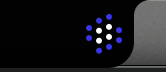

## Description

Restore the Listening and Playing dot-matrix loaders to their original
SVG-derived rotational animation. The current amplitude-driven pseudo-wave was
introduced by RR-304 in `03a4eab1` and intentionally disables rotation for
these two states, which matches the reported visual regression: the dots bend
vertically with audio level instead of performing the designed rotational
loop.

Use the implementation immediately before `03a4eab1` as the canonical motion
reference. It preserves the 0.6-second loop, rotates the four white core dots
through a quarter turn, and applies the original bounded accent-dot pulse and
shimmer. The prior implementation and deterministic keyframe test remain in
Git, so replacement SVG files are not required. Preserve the current artwork,
orange Listening palette, blue Playing palette, notch placement, and
surrounding overlay geometry.

Remove the audio-reactive displacement as the Listening/Playing visual path.
Clean up only the level-delivery and smoothing code that becomes unused by the
restore; do not alter recording, transcription, TTS, replay, cancellation, or
media behavior. Working and Not working visuals remain unchanged.

## Animation review

| Before | After | Why |
| --- | --- | --- |
| Listening and Playing route every dot through a vertical amplitude offset and explicitly disable their animation timer | Restore the original SVG-derived core rotation, accent pulse, shimmer, and 60 Hz redraw loop | The amplitude warp replaced the designed state-indicating motion and current tests lock in the regression |

**Verdict — Block:** this is a feel-breaking motion regression. The original
rotation is recoverable exactly from Git and should replace the pseudo-wave
rather than being approximated from the static reference.

## Acceptance criteria

- [ ] Listening and Playing again report that glyph motion is active whenever Reduce Motion is off; Not working remains static and Working retains its existing loop.
- [ ] Both active states match the pre-`03a4eab1` 0.6-second SVG-derived timeline: the white core reaches 45 degrees at phase `0.6683` and 90 degrees at the end of the cycle.
- [ ] Accent dots use the original bounded outward/inward pulse and shimmer instead of the amplitude-driven vertical pseudo-wave, without changing their exported positions, diameters, opacity range, or orange/blue color assignments.
- [ ] Listening and Playing use the original continuous redraw path and transition cleanly between states without a frozen first frame, phase jump, stale audio deformation, or animation restart artifact.
- [ ] Reduce Motion keeps a clear static Listening/Playing presentation and does not run an unnecessary display timer.
- [ ] Audio-envelope plumbing made unused by the visual restore is removed without changing microphone capture, transcription delivery, initial TTS playback, replay, stop, cancellation, media pause/resume, or provider ownership behavior.
- [ ] Deterministic tests replace the inverse RR-304 assertions, cover Listening and Playing keyframes and accent offsets, prove audio amplitude cannot replace the loop, and preserve Working/Not working behavior.
- [ ] A fresh mounted app is checked in slow motion or frame by frame through Listening, initial Playing, and replay Playing; the result visibly matches the recovered original motion and the attached notch reference remains geometrically unchanged.
- [ ] Mounted lifecycle checks cover both Codex and Claude, or document any provider-specific limitation before review.

## Attachments

- 

## Provenance

- Regression introduction: `03a4eab1` (`feat: make notch dots audio-reactive (RR-304)`).
- Canonical restore reference: `03a4eab1^:Sources/relay-runner/Overlay/NotchStatusController.swift` and the former `testNotchGlyphMotionMatchesAnimatedSVGKeyframes` test.
- Current regression locks: `NotchStatusController.swift:61-63`, `:214-245`, `:2014-2044`, `:2071-2080`, and `NotchStatusPlacementTests.swift:1078-1109`.
