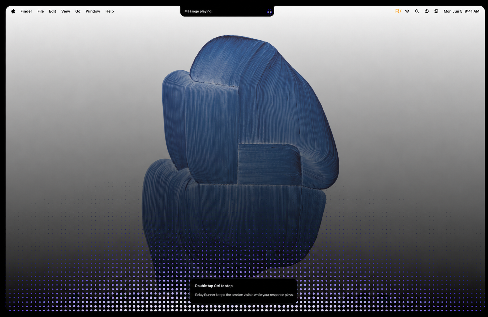
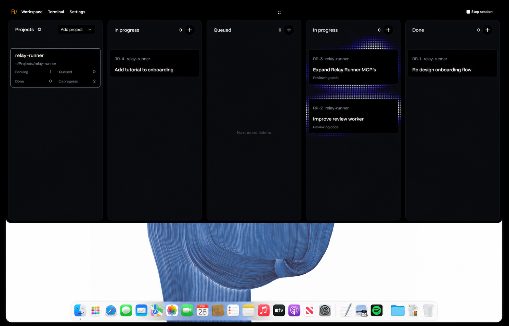

<div align="center">

# Relay Runner

**Talk to Codex or Claude while a native macOS workspace keeps your sessions, project tickets, and agent progress in view.**

[Get started](#get-started) · [See the product](#a-voice-layer-and-a-workspace) · [Privacy](#what-stays-local) · [Documentation](#go-further) · [Contribute](CONTRIBUTING.md)

</div>



*A response plays locally while the notch and perimeter animation show session state without covering the work underneath.*

Relay Runner adds a voice and coordination layer to the coding agents you already use. Speak a request, keep the full interactive provider session available, and move into Workspace when the work needs a project, a ticket, or a worker you can follow.

## What you can do

- Speak to an interactive Codex or Claude session and hear replies without sending microphone audio to a speech service.
- Keep listening, transcription, playback, and permission state visible in a compact macOS overlay.
- Register Git projects from anywhere on the Mac and start sessions with an explicit project scope.
- Turn project work into repo-owned Relay tickets, dispatch isolated workers, and review progress in Workspace.
- Optionally let the active agent manipulate macOS through Relay Actions or inspect the screen through Relay Vision.

Voice augments the normal CLI session; Relay Runner is not a hosted IDE, a cloud copy of your repositories, or an autonomous release service.

## A voice layer and a Workspace

The voice layer captures audio, transcribes it with Parakeet, delivers text to the configured agent session, and speaks replies with Kokoro. Listening and playback have visible states, and the overlay recedes when it has nothing to say.

Workspace is the project side of the same session. Select a registered local repository, start a project-scoped Codex or Claude terminal, create or inspect tickets, and follow orchestration and worker progress without treating the app's support directory as a project.



*Workspace keeps project selection, the active session, tickets, orchestration, and worker review in one native surface.*

A typical project flow is short:

1. Add an existing Git repository in Workspace and select it.
2. Start a Codex or Claude session from the embedded Terminal tab.
3. Speak conversationally, or refine concrete project work into a visible ticket.
4. Move a ready ticket into the queue; Relay Runner runs the worker in an isolated worktree and shows its lifecycle through review.

The repository remains the durable boundary. Relay artifacts live with the registered project; the application-support registry only remembers which projects exist and holds rebuildable runtime state.

## What works today

| State | Capabilities |
| --- | --- |
| **Shipped** | Native macOS app; Codex and Claude sessions; local Parakeet transcription and Kokoro speech; embedded Terminal; project registry; Workspace tickets; orchestrator and isolated worker runs; visible lifecycle and replay controls. |
| **Optional** | Relay Actions for clicks, typing, keys, scrolling, project activation, and window inspection; Relay Vision for screenshots. These are installed for both providers and work only with the macOS permissions you grant. |
| **Evolving** | Artifact-ref storage, synchronization, retention, migration, and staged lifecycle policies have explicit per-project rollout boundaries. The early-release UI and provider model catalog will continue to change. |
| **Known limits** | macOS 14 or later; Apple Silicon is recommended; TTS is currently English; provider models and effort levels depend on the user's account; agents can make consequential changes when permission bypass is enabled; the orchestrator stops at reviewed project work and does not release or deploy automatically. |

## What stays local

Speech processing is local, but the configured coding agent is still an online provider unless your provider setup says otherwise.

| Data | What Relay Runner does |
| --- | --- |
| Microphone audio | Captured and transcribed on the Mac. Relay Runner does not upload raw microphone audio. |
| Spoken replies | Synthesized and played on the Mac. |
| Transcribed prompts | Sent as text to the active Codex or Claude session, like text typed into that session. |
| Source and terminal context | Available to the provider CLI under that CLI's permissions and the working directory you selected. |
| Relay Vision screenshots | Captured only when the tool is invoked, then returned to the requesting agent and therefore may reach its provider. |
| Project registry and run state | Stored locally. Ticket and artifact files remain in the project repository and travel only when you commit or sync them. |
| Updates, models, and setup packages | Downloaded over the network from the documented release, model, and package sources. |

Permissions are deliberately separate:

- **Microphone** is required for voice input.
- **Accessibility** is optional. It hosts Relay Actions and can observe global shortcuts; without it, voice still works from the menu-bar record control.
- **Input Monitoring** is an optional listen-only fallback for global shortcuts, including non-Caps-Lock activation keys and the Workspace hotkey.
- **Screen Recording** is optional and used only by Relay Vision screenshots.

Relay Runner attributes Accessibility and Screen Recording to **Relay Runner.app**, not to Terminal, Codex, or Claude. See [Privacy and permissions](docs/privacy.md) for storage, network, and permission details.

## Get started

### Install the signed release

You need macOS 14 or later, an internet connection for first-run downloads, and an account that can authenticate either Codex or Claude Code.

1. Download `RelayRunner.dmg` from the [latest GitHub release](https://github.com/matthewthomas94/relay-runner/releases/latest).
2. Open the DMG, run **Relay Runner.app**, and let the installer place it in `/Applications`.
3. In onboarding, choose Codex or Claude, complete that provider's sign-in, and grant Microphone access. Accessibility, Input Monitoring, and Screen Recording remain optional.
4. Let setup prepare the local Python voice runtime, Relay skills, MCP tools, and speech models. The first setup downloads several hundred megabytes and can take a few minutes.
5. Add a Git repository in Workspace, select it, and choose **Start Session**.

Relay Runner starts the chosen provider in its embedded terminal and keeps the session alive when Workspace closes. **End Session** stops it. Terminal.app remains available as a compatibility path.

### Build from source

Source builds require Xcode 16 or later, its command-line tools, Git, and a Python installation that can import `dmgbuild`.

```bash
git clone https://github.com/matthewthomas94/relay-runner.git
cd relay-runner
python3 -m pip install --user --break-system-packages dmgbuild
RELAY_SKIP_APPLICATIONS_REFRESH=1 ./scripts/build-dmg.sh
```

Artifacts are written to `dist/Relay Runner.app`, `dist/RelayRunner.dmg`, and `dist/RelayRunner.zip`. With no Developer ID environment configured, the script creates an ad-hoc-signed build for local testing; it is not a distributable signed release. `RELAY_SKIP_APPLICATIONS_REFRESH=1` prevents the packaging check from replacing an existing `/Applications/Relay Runner.app`.

For faster code iteration, use `swift build` and `swift test`. See [Contributing](CONTRIBUTING.md) and [Testing](TESTING.md) for the full clean-checkout path.

## Codex and Claude, side by side

| | Codex | Claude Code |
| --- | --- | --- |
| Authentication | `codex login`; Relay Runner detects the local Codex auth file. | `claude /login`; Relay Runner detects the Claude Code keychain entry. |
| Session launch | The selected stable model family resolves through the installed Codex catalog. Effort is passed as `model_reasoning_effort`. | The selected stable model alias and supported effort are passed with `--model` and `--effort`. |
| Permission bypass | Optional `--dangerously-bypass-approvals-and-sandbox`. | Optional `--dangerously-skip-permissions`. |
| Voice and tools | Same onboarding, project scope, Relay skills, local speech, Workspace, Relay Actions, Relay Vision, tickets, and worker lifecycle. | Same. |

The bypass setting is on by default for uninterrupted voice flow. Turn it off in **Settings → General** if you want the provider CLI to request its normal per-tool approvals. Provider plans decide which models and effort levels are actually available. See [Provider setup and parity](docs/providers.md) for model choices, manual session entry, and intentional differences.

## How it fits together

```text
microphone → Parakeet STT → foreground Codex or Claude session → provider
                    │                    │
                    │                    ├─ optional Relay Actions / Vision
                    │                    └─ project-scoped tickets and workers
                    │
                    └─ tool-free provider messenger → Kokoro TTS → speakers
```

The Swift app owns audio, Workspace, the embedded terminal, permissions, and the visible overlays. Local Python services coordinate voice, messaging, tickets, and worker lifecycle. Bundled MCP helpers expose Relay Actions, Relay Vision, and the orchestrator to both supported providers. See the [architecture overview](docs/architecture.md) for process and storage boundaries.

## Go further

- [Architecture](docs/architecture.md) · [project scope](docs/architecture/project-scope-v2.md) · [registry](docs/architecture/registry-v2.md)
- [Orchestrator](docs/orchestrator.md) · [ticket schema](docs/specs/orchestrator-tickets.md)
- [Artifact store](docs/architecture/artifact-store.md) · [lifecycle](docs/architecture/artifact-lifecycle.md) · [sync](docs/architecture/artifact-sync.md) · [retention](docs/architecture/artifact-retention.md)
- [Relay Actions](docs/specs/relay-actions.md) · [Relay Vision](docs/specs/relay-vision.md)
- [Configuration](docs/configuration.md) · [Troubleshooting](docs/troubleshooting.md) · [Testing](TESTING.md) · [Release process](docs/release-updates.md)

## Project routes

- Read [Contributing](CONTRIBUTING.md) and the [Code of Conduct](CODE_OF_CONDUCT.md) before opening a change.
- Use [Support](SUPPORT.md) for questions and bug reports.
- Report vulnerabilities through the private route in [Security](SECURITY.md), not a public issue.
- Relay Runner is available under the [MIT License](LICENSE). Third-party code, models, and artwork retain their own terms; see [Third-party notices](THIRD_PARTY_NOTICES.md).

Relay Runner builds on FluidAudio and NVIDIA Parakeet for local transcription, Kokoro for local speech, SwiftTerm for the embedded terminal, Sparkle for updates, and the Codex and Claude Code CLIs for provider sessions. Thank you to those maintainers and communities.
