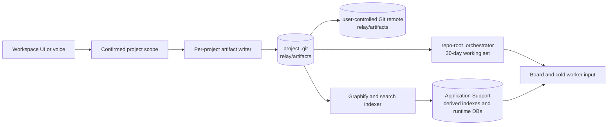
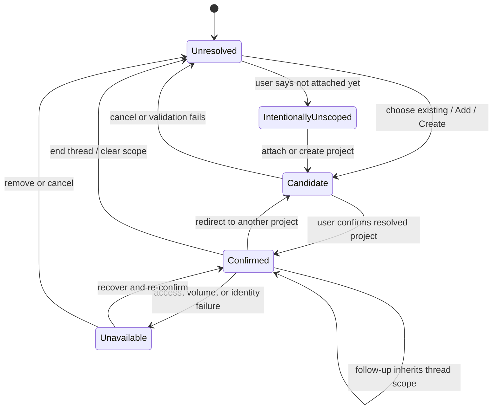

# RR-270: repo-local Relay artifacts, explicit scopes, and bounded materialization

Status: architecture recommendation

Date: 2026-08-03

Scope: product and architecture spike only; no migration or production behavior was changed

The spike was time-boxed to one `strong`/`high` worker pass. Its exit condition was a source-backed current-state map, one selected architecture, explicit state machines and policies, a migration/verification plan, and cold-start follow-up slices. Questions that require implementation evidence are assigned to those slices rather than extending this pass into production work.

## Executive decision

Keep every project's durable Relay artifacts in that project's own Git object database and user-controlled remote, on one Relay-owned branch named `relay/artifacts`. The branch head contains the current `.orchestrator/` tree: project configuration, a compact archive catalog, tickets with relevant activity in the last 30 days, their eligible attachments, and project-scoped Program records. Older tickets are removed from the branch head by ordinary commits but remain reachable in the branch history and are restored by a new ordinary commit.

Relay materializes the branch head's active `.orchestrator/` paths into the registered repository root as a write-through working set. The materialization is excluded from the source branch through `.git/info/exclude`; it is neither a second canonical store nor a bidirectional mirror. All mutations go through one project artifact writer, which commits to `relay/artifacts` using a private Git index and then refreshes the materialization. Agents never infer ownership from a terminal working directory.

This dedicated branch is preferable to committing automatic ticket synchronization onto the user's source branch. It prevents Relay from accidentally pushing unrelated source commits, works while the source working tree is dirty, gives ticket synchronization a single conflict domain, and still keeps the data in the project repository rather than an app-owned repository.

The application-support directory remains app-global operational state only. It stores the logical project registry, references to Keychain-held filesystem bookmarks, run databases, Graphify/index data, caches, locks, and ephemeral worker worktrees. It does not store a writable canonical copy of any project's tickets.

## Non-goals and invariants

This design does not:

- create a GitHub repository, choose a hosting provider for the user, or silently add/change a remote;
- move, copy, nest, or rewrite a registered project repository;
- require repositories to share a parent directory, Workspace folder, parent repository, submodule, or source branch;
- infer ticket ownership from the current directory, frontmost terminal, or filesystem proximity;
- automatically force-push or rewrite artifact history;
- treat a private GitHub repository as a secrets vault or unlimited binary store;
- turn unscoped conversation into a durable ticket; or
- preserve every historical ticket as a file in the normal `.orchestrator/` working set.

The fixed invariants are:

1. One immutable `project_id` identifies a project across paths, clones, providers, and devices.
2. One Git ref in that project repository is the canonical writable artifact store.
3. One local writer serializes mutations to that ref. Other processes submit operations to it.
4. The repo-root `.orchestrator/` directory is a verifiable materialization of the canonical ref, not an independently authoritative store.
5. App-global databases may cache or index project data, but project artifacts can be rebuilt without them.
6. A work action requires a confirmed project scope. Unscoped work cannot dispatch.
7. Sync uses fetch, rebase of unpublished Relay-only commits, and normal fast-forward push. It never force-pushes.

## Current implementation map

### Project and Workspace resolution

| Boundary | Current behavior | Consequence for this design |
|---|---|---|
| `Sources/relay-runner/Board/ProjectRegistry.swift:14-43` | Registry records use resolved filesystem paths as both `id` and `repoPath`; the document also stores one active project or workspace root. | Moving a repository changes identity. There is no clone-stable ID. |
| `ProjectRegistry.swift:250-263` | Registry lives at `~/Library/Application Support/relay-runner/program/projects.json`. | The app already has an appropriate app-global registry location, but the schema needs versioning, stable IDs, recovery, and access-grant references. |
| `ProjectRegistry.swift:95-159, 455-485` | Activation resolves a containing Git root; discovery scans only immediate child directories and treats their presence as a workspace root. Activation may create `.orchestrator/config.toml`. | Filesystem layout and activation currently determine scope; arbitrary registered paths and non-mutating validation need to replace discovery as the primary model. |
| `Sources/relay-runner/Board/ProjectResolver.swift:37-79, 154-209` | A live bridge's `/tmp/voice_bridge.cwd` is the preferred route. Without it, only a programmatically activated registry record can route Work. | Cwd may remain a suggestion, but must not confirm ownership. Workspace should load the registry before a bridge exists. |
| `Sources/relay-runner/Config/WorkspaceFolder.swift:3-33` and `ConfigManager.swift:70-80, 146-160` | `general.working_directory` is persisted and fed back into root discovery and Start Session. Empty resolves to the home directory. | Retire it as Workspace identity. Keep a provider launch-directory preference only where needed. |
| `Sources/relay-runner/Config/WorkspaceDirectoryPicker.swift:16-22` | One directory picker backs the current workspace-folder flow. | Reuse an `NSOpenPanel` only inside Add/Create project, validate before mutation, and persist a security-scoped bookmark. |
| `Sources/relay-runner/Board/BoardProjectConfig.swift:20-41` | Activating a Git repo can create `.orchestrator/config.toml`; numeric IDs use a mutable `next_id`. | Registration must be non-mutating until confirmation. Multi-device creation needs a collision-resistant immutable artifact ID in addition to the familiar display ID. |

There is no security-scoped bookmark implementation in the current project registry. Paths are standardized and symlinks resolved, but reopening depends on the path still being accessible.

### Ticket ownership, attachments, and board reads

| Boundary | Current behavior | Consequence for this design |
|---|---|---|
| `ProjectResolver.swift:235-260` | The board enumerates Markdown files directly from `<repo>/.orchestrator/`. | A materializer can preserve this local read shape during migration, but historical cards must come from the archive catalog rather than directory enumeration. |
| `Sources/relay-runner/Board/TicketWriter.swift` | New/edit/status operations write files directly and update `config.toml`. | Route saves through the artifact writer as typed operations with compare-and-swap base object IDs. |
| `Sources/relay-runner/Board/TicketImageStore.swift:19-88` | Image files are copied to `.orchestrator/attachments/<ticket-id>/` and linked from Markdown. | Preserve ticket ownership and path containment, while adding privacy, type, and byte limits before the Git commit. |
| `Sources/relay-runner/Board/ProgramBoardStatus.swift:1051-1255` | Program detail resolves a ticket and image by direct repo-root paths; a missing file is an error. | Add `materialized`, `archived`, `restoring`, `sync_pending`, and `unavailable` states. Archived detail reads a fetched Git object without first making the ticket active. |
| `docs/specs/orchestrator-tickets.md:31-47` | `config.toml` contains a prefix and numeric `next_id`; concurrent branches can collide and require a manual rename. | Preserve existing IDs, but give new records an immutable ULID/UUID and make offline display-ID collisions an explicit sync conflict. |

### Daemon, workers, and run audit

| Boundary | Current behavior | Consequence for this design |
|---|---|---|
| `services/orchestrator.py:287-363` | App-global daemon data is under `.../relay-runner/orchestrator`; worker worktrees default below it; registry is read from `program/projects.json`. | Consolidate path ownership under the versioned application-support layout and resolve projects by stable ID. |
| `orchestrator.py:3489-3496` | `runs.db`, `runs.json`, `queue_drains.db`, `orchestrator_sessions.db`, `orchestrator_commands.db`, `messenger_outcomes.db`, and `graphify.db` are global files. | These remain operational or derived data, with per-project foreign keys and explicit backup/retention. They are not ticket authorities. |
| `orchestrator.py:657-676, 4704-4709` | Dispatch copies the ticket and its ticket-owned attachments into a source worktree after `git worktree add`. | Materialize the ticket plus required dependency summaries from `relay/artifacts`; do not require it to be tracked on the source branch. |
| `services/orchestrator_workflow.md` and `orchestrator.py:2882-2935` | A worker commits code and its claimed/done ticket update on the same worker branch; validation requires both. | Split outputs: the worker commits source code on its worker branch and submits a structured ticket run-log/status operation. The artifact writer publishes claim/done only at lifecycle-safe points. |
| `orchestrator.py:5220-5364` | Review reads the worker's ticket file, merges its branch into the source checkout, then trusts the merged ticket's `done` status. | Review merges source only. After merge succeeds, the daemon atomically commits `done` and the run summary to `relay/artifacts`; a failed merge leaves the ticket active. |
| `orchestrator.py:4537` and `Sources/relay-runner/Board/RunStateStore.swift:132-190` | Raw worker logs are under the ephemeral worktree while the UI reads a shared `runs.json` projection. | Keep raw logs local with a retention cap. Commit only bounded, user-safe run summaries; raw traces and hidden reasoning never enter Git. |

### Program/Graphify and fresh install

`services/graphify_ingest.py:29-236` reads the registry, current ticket files, and `runs.db`, then copies project/ticket/run representations into `graphify.db`. Those nodes are derived. `services/session_capture.py:71-165`, however, can create decisions, risks, ideas, statuses, and program events that have no repo-local source. Migration must export project-scoped captures into the owning project's artifact branch before Graphify can be treated as fully rebuildable. Truly app-global, cross-project UI preferences may remain app-global; project work may not.

The current personal fresh-install helper discovers project `.orchestrator/` trees, records a content manifest, and verifies those trees and Git statuses after reinstall. That is appropriate for today's direct-files model. In the target model, upgrade/reinstall preserves application support, while a destructive first-run reset moves Relay-owned app state to Trash and never edits registered repositories. Re-adding a repository can reconstruct active tickets from its local `relay/artifacts` ref or its configured remote.

## Target topology



### Project repository

Canonical ref: `refs/heads/relay/artifacts`

Default remote branch: `refs/heads/relay/artifacts` on the user-selected existing remote

The canonical branch uses an orphan-style tree so source files are not duplicated into every artifact commit:

```text
.orchestrator/
  config.toml
  archive-index.jsonl
  RR-270.md
  attachments/
    RR-270/
      architecture.png
  program/
    events/
      01K...json
```

`config.toml` gains:

```toml
schema_version = 2
project_id = "019c..."       # immutable UUIDv7/ULID-class identity
prefix = "RR"
artifact_ref = "refs/heads/relay/artifacts"
remote_name = "origin"      # optional; selected, never guessed and written silently
remote_sync = "enabled"     # enabled | local_only | paused
```

Existing numeric ticket IDs remain valid. New tickets have both an immutable `artifact_id` and a display `id`. Online numeric IDs are allocated only after fetching and are committed with the `next_id` update. Offline collisions are reminted before publication and references are updated in the same local-only commit chain; immutable `artifact_id` keeps identity stable. A later schema ticket may replace numeric display allocation with a sortable globally unique suffix, but this spike does not require that UI change.

The repo-root `.orchestrator/` materialization contains the branch-head files above. Relay records its base ref/object IDs in an app-global cache and writes through one service. It uses `.git/info/exclude` to keep materialized files out of source-branch status without modifying the user's committed `.gitignore`. A manual edit is not authoritative until an explicit Save/import operation successfully commits it to the artifact ref. If the file and ref both changed from their shared base, the writer reports a conflict instead of choosing one.

Git operations use a private temporary index (`GIT_INDEX_FILE`), `read-tree`, allowlisted `update-index`, `write-tree`, and `commit-tree`, followed by compare-and-swap `update-ref`. This leaves the user's source index, source branch, and dirty files untouched. Only these paths are allowed:

- `.orchestrator/config.toml`;
- `.orchestrator/archive-index.jsonl`;
- `.orchestrator/<ticket-id>.md`;
- `.orchestrator/attachments/<same-ticket-id>/<validated-name>`; and
- `.orchestrator/program/events/<event-id>.json`.

No catch-all staging, path traversal, symlink, submodule entry, or source path is accepted. One logical operation produces one artifact commit. Commit trailers include `Relay-Project-ID`, `Relay-Event-ID`, `Relay-Device-ID`, and the provider-neutral actor type. Event IDs make retries idempotent.

### Application-support home

Exact root: `~/Library/Application Support/relay-runner/`

```text
config.toml
projects/
  registry-v2.json
  registry-v2.backup.json
orchestrator/
  runs.db
  runs.json
  queue_drains.db
  orchestrator_sessions.db
  orchestrator_commands.db
  messenger_outcomes.db
  locks/<project-id>.lock
program/
  graphify.db
indexes/<project-id>/
  catalog.sqlite
  search.sqlite
caches/<project-id>/
  fetched-objects.json
  materialization.json
workspaces/<project-id>/<run-id>/
migration/
  journal.json
  manifests/<project-id>.json
backups/
  registry-v2-<timestamp>.json
```

The registry contains stable project ID, display name, last resolved path, Git common-directory fingerprint, selected remote/ref, bookmark Keychain key, availability, and timestamps. Security-scoped bookmark bytes live in a Keychain item with service `com.relayrunner.project-bookmark` and account `<project-id>`; the JSON never embeds the grant. Atomic writes, schema versioning, a last-known-good backup, and a migration journal guard corruption.

`workspaces/` contains only transient linked worker worktrees. A registered primary project is never copied or relocated there, and nothing there is a canonical ticket store. Graphify and search databases are rebuildable projections. Run databases are local operational/audit state; only bounded run summaries in the project artifact history are durable cross-device evidence.

Backup rules:

- normal upgrades and reinstalls preserve the whole root;
- a deliberate first-run reset moves the root to Trash with a manifest, never touches project repositories, and may be recovered from Trash;
- the registry is exportable without bookmark bytes; access is regranted through Add project on another Mac;
- losing all app-global state loses caches, detailed local run telemetry, and registrations, but not project artifacts; and
- missing/corrupt registry load first tries the atomic backup, otherwise quarantines the bad file and opens an empty Add project state.

## Registration, identity, and filesystem access

### Add project

1. Workspace opens directly from `registry-v2.json`; an empty registry shows Add project and Create project.
2. Add project opens a directory-only panel. No browser appears during normal Workspace open.
3. Validation runs `git rev-parse --show-toplevel`, rejects bare repositories, resolves symlinks, obtains `--git-common-dir`, checks read/write access, and inspects/fetches no remote yet.
4. Relay reads `project_id` from `relay/artifacts` when present. For a legacy repo it proposes a new ID but does not write until confirmation.
5. The confirmation sheet shows display name, resolved path, whether it is a worktree, selected existing remote or Local only, and any duplicate.
6. Confirm persists the bookmark/registry, then initializes the artifact ref only when necessary. Cancel has no filesystem effect.

Duplicate detection is layered:

- same standardized path or file resource identifier: exact duplicate;
- same Git common directory: another worktree of the same local repository;
- same committed `project_id`: another clone/worktree of the same Relay project; and
- same normalized remote URL without the same project ID: warning only, because forks and remote changes are valid.

Only one primary worktree per `project_id` is active on a Mac. Other Git worktrees appear as alternatives, not separate projects. Relay-created worker worktrees are never registrable.

Recovery behavior:

| Condition | Behavior |
|---|---|
| Moved or renamed | Resolve the bookmark, verify `project_id`, update only `last_resolved_path`. |
| Deleted path | Mark unavailable; retain registry metadata; offer Locate or Remove. |
| Disconnected volume | Mark offline; do not unregister or mutate; retry on volume mount. |
| Permission revoked/stale bookmark | Prompt Locate/Grant Access; refresh the bookmark only after ID verification. |
| Symlink | Store the user-facing selection plus resolved canonical path; duplicate checks use the resolved resource/common directory. |
| Bare repository | Refuse as an active project because board materialization and workers require a worktree; offer Clone/Create Worktree. |
| User-managed Git worktree | Allow as the one primary local location; identity comes from the artifact ref, not the worktree path. |
| Artifact branch missing locally | Fetch the exact configured ref; if no remote or ref exists, offer verified legacy import or empty initialization. |
| Artifact branch belongs to another project | Stop and require an explicit branch-name/identity recovery decision. |

Remove project stops sessions, releases the security-scoped resource, deletes Relay-owned caches/indexes after confirmation, and unregisters the record. It never deletes or edits the repo, its `.orchestrator/` materialization, Git refs/history, remotes, source files, or remote branches.

## Work-scope state machine



Rules:

- A project mutation, ticket authoring action, dispatch, archive, restore, or sync requires `Confirmed(project_id, thread_id)`.
- A terminal cwd, bridge cwd, file mention, frontmost window, or provider session may nominate a `Candidate`; none confirms it.
- The confirmation names the project and resolved path. Follow-ups inherit the confirmed thread scope until explicit redirect, thread end, cancellation, or project unavailability.
- “Use project B” redirects only that work thread. “Never mind” cancels the current unresolved item; only an explicit global cancel clears unrelated confirmed work.
- `IntentionallyUnscoped` creates no ticket and cannot dispatch. Relay may keep a bounded runtime intent summary in the private intent inbox so the scope prompt survives a restart, but it is not shown as a board card and expires. To make it durable, the user must select an existing project or create/register a new Git project.
- Create project asks for parent location and repository name, shows the resulting path, runs `git init` only after confirmation, registers it, then initializes the artifact branch. Add project never initializes a non-Git folder.
- If a confirmed project becomes unavailable, mutations stop. Read-only cached summaries are labeled stale; Relay never silently falls back to another project.

UI and voice are provider-neutral. Workspace has a persistent project switcher and Add project action; voice gives the same choices concisely and confirms the selected name when ambiguous. Codex and Claude receive the same `project_id`, resolved path, artifact base commit, and thread-scope token. Their CLI authentication, launch flags, model names, and effort flags remain provider-specific and do not change scope semantics.

## Retention and materialization policy

Retention states are `materialized_recent`, `materialized_exempt`, `archive_eligible`, `archive_pending_sync`, `archived`, `restore_pending_fetch`, `restore_pending_sync`, `conflict`, and `deleted_tombstone`. The planner runs after project registration, successful sync, and terminal lifecycle events, plus at most once per 24 hours while the project is available. Planning is read-only; the writer rechecks every predicate immediately before a transition.

### Precise age rule

Every ticket gains an `activity_at` RFC 3339 UTC instant. The artifact writer updates it for user/PM edits, dependency changes, status/cancellation changes, dispatch claim, run outcome, review/merge outcome, attachment changes, archive restore, and explicit reopen. Read, sync, index, and materialization events do not update it.

At evaluation instant `T`, the rolling cutoff is exactly `T - 30 * 24 hours`. A ticket is recent when `activity_at >= cutoff`; the boundary is inclusive and independent of local time zone or daylight-saving changes. Legacy tickets receive an anchor from the newest artifact-affecting Git committer timestamp during migration, recorded explicitly in the bootstrap commit. File mtime is never authoritative.

A ticket remains materialized regardless of age when any of these is true:

- status is `ready` or `in_progress`;
- it has a claimed/running/awaiting-review/merge-conflict run;
- it is blocked by an unresolved dependency or explicitly marked blocked;
- it has a pending local mutation or unresolved sync conflict; or
- a worker/reviewer snapshot lease references it.

Old `backlog`, `done`, or canceled tickets with no exemption are archive candidates. For a remote-enabled project, offline candidates stay `archive_pending_sync` and remain materialized. Local-only projects may archive locally with a visible warning that no remote recovery exists.

### Archive transition

1. Acquire the project writer lock and refresh the artifact ref.
2. Re-evaluate age and exemptions against one captured UTC instant.
3. Record an `archive-index.jsonl` entry containing immutable artifact ID, display ID, title, terminal/current status, `activity_at`, ticket path, attachment paths/sizes, and the pre-archive source commit and blob IDs.
4. Commit deletion of the ticket and its attachments plus the deterministic index update in one commit.
5. Verify every deleted blob is reachable from the artifact ref history and the catalog resolves it.
6. For remote-enabled projects, fast-forward-push the archive commit before removing files. If push fails, move the unpublished local ref back to its verified parent with compare-and-swap, keep the materialization, and retry later. This rewrites no published history.
7. Atomically remove the repo-root materialization and refresh Graphify/search. Local-only projects proceed after local reachability verification.

The archive index is a compact, deterministic projection used for discovery; it is not editable ticket content and cannot change ticket truth. Archived cards appear in search/history with title, status, date, sync availability, and Restore. Detail can stream the historical blob read-only without restoring.

Dependencies may resolve a completed archived predecessor through the catalog's immutable ID/status record. A blocked or otherwise active dependent itself remains materialized. Dispatching or editing an archived ticket first performs restore.

### Restore, offline, and delete

Restore resolves the catalog pointer, reads the historical blobs, and verifies their IDs. If objects are missing from a shallow local fetch, Relay fetches/deepens only the configured artifact ref. Offline restore succeeds when the objects are local; otherwise it reports `needs_network` without creating a partial file. A restore commit re-adds the ticket and eligible attachments, sets `activity_at` to the restore instant, adds a restore event, updates the catalog, and then rematerializes it.

“Delete” is a recoverable tombstone: an ordinary commit removes the active file, keeps a catalog entry under Deleted, and does not claim to erase history. “Purge sensitive data” is a separate high-risk manual recovery workflow requiring credential rotation where applicable, coordinated history rewriting, remote support steps, and explicit user confirmation. Relay does not perform it as routine retention.

## Git strategy comparison

| Strategy | Working-tree bound | Separates source pushes | Remote discover/restore | Conflict surface | Decision |
|---|---:|---:|---:|---:|---|
| Delete old ticket files on the normal source branch | Yes | No | Yes, via history/index | Source and ticket commits, dirty-tree integration, worker merges | Reject. Automatic sync can publish unrelated source commits or block behind source state. |
| Dedicated `relay/artifacts` branch with repo-root write-through materialization | Yes | Yes | Yes, explicit ref plus compact catalog | Artifact-only; same-ticket conflicts remain | **Recommend.** One project-owned authority without source-branch coupling. |
| One archive branch plus active tickets on the source branch | Yes | No | Yes | Two writable ticket locations and cross-branch moves | Reject. It creates dual authority and complex atomic transitions. |
| Per-ticket refs/branches | Yes | Yes | Yes | Thousands of refs, expensive discovery/fetch, unclear ordering | Reject. Operational complexity exceeds value. |
| App-owned central Git artifact repository | Yes | Yes | Yes | Cross-project routing and identity become centralized | Reject. Violates project ownership and creates the forbidden parent/second store. |
| Git LFS for all artifacts | Partly | Depends | Requires LFS service/client | Pointer/object lifecycle and billing | Reject as default. Permit only explicit large-asset policy after setup. |
| Shallow/filtered fetch as the retention mechanism | No for existing full clones | Yes | Older restores require network/deepen | Missing objects/offline behavior | Reject as the canonical model; use as an optional transfer optimization. |

The recommended branch head bounds checked-out file count, not total Git storage. Deleting a file by commit leaves it in history. Full clones keep reachable historical objects; shallow artifact-ref fetches reduce initial transfer but deepen on older restore and do not guarantee a forever-bounded object database.

## Synchronization state machine

States: `local_only`, `clean`, `ahead`, `behind`, `diverged_auto`, `conflict`, `offline`, `auth_required`, `remote_missing`, `paused`.

For each logical mutation:

1. Resolve stable project ID and acquire the per-project local writer lock.
2. Validate the selected remote/ref and current materialization base.
3. If online, `fetch` the exact artifact ref. Never fetch arbitrary pull-request refs.
4. Fast-forward the local artifact ref when it is behind and has no unpublished commits.
5. When both sides advanced, rebase only unpublished Relay artifact commits onto the fetched remote tip. Different-ticket/path changes may resolve automatically. Same-ticket, config allocation, delete/edit, attachment-name, and catalog semantic conflicts stop for resolution.
6. Apply the typed operation with a private index and allowlisted paths. One logical lifecycle event equals one commit; retries reuse `Relay-Event-ID`.
7. Validate schema, dependency graph (including archived summaries), size/privacy policy, blob reachability, and materialization manifest.
8. Push with a normal fast-forward refspec. No `--force`, `--force-with-lease`, or remote deletion.
9. If push is rejected because the remote advanced, return to fetch/rebase with a bounded retry count. After that, show `conflict` or `sync_pending` rather than looping.
10. Update the local materialization and derived indexes from the accepted local ref. Release the lock.

Offline mutations create local commits and show `pending sync`. Collision-resistant event/artifact IDs prevent duplicated actions. Numeric display-ID collision resolution happens before publish and is visible in the activity log. Across devices there is no distributed lock: the remote ref's fast-forward rule is the concurrency gate. Same-ticket conflicts never use last-write-wins. The resolver presents base/local/remote ticket fields, preserves both attachment variants, and commits the user's resolution normally.

Remote bootstrap behavior:

- no remote: stay `local_only`; local history is complete, and UI explains that device loss is not remotely recoverable;
- existing remote but no artifact ref: ask before the first push, then create only `relay/artifacts` with a normal push;
- auth failure: keep local commits, mark `auth_required`, and never discard them;
- deleted remote ref: pause and ask whether to recreate from the verified local ref or relink;
- protected artifact ref: respect the rejection; support an explicitly configured PR workflow later rather than bypassing rules; and
- ordinary source changes: ignored by the artifact writer's orphan tree/private index, so they are neither staged nor pushed.

## Worker and lifecycle contract

1. Dispatch resolves a confirmed project and artifact commit, then verifies the ticket is materialized and dispatchable.
2. The daemon commits `in_progress`, `run_id`, and `activity_at` through the artifact writer before launching. A launch failure gets its own outcome commit.
3. The source worker worktree is based only on the user-selected source branch. The daemon places a read-only snapshot of the ticket, required attachment blobs, and bounded archived dependency summaries under `.orchestrator/` for cold-start input.
4. The worker may modify source files and commit them on `relay/<ticket-id>`. It submits a structured run summary and proposed ticket outcome to the daemon; it does not commit canonical ticket files on the source branch.
5. The review worker inspects/tests the source diff for either provider. Retry appends a bounded artifact event and keeps the ticket active.
6. Acceptance merges the source branch using the existing daemon-managed path. Only after source merge succeeds does the artifact writer commit `done`, the final run summary, and dependency progression. This commit is the board-visible lifecycle authority.
7. Worker worktree removal cannot remove canonical ticket or attachment data. Raw logs move to capped local run-log storage before pruning when retention policy requires them.
8. Archive never runs while a worker, reviewer, conflict, or snapshot lease references the ticket.

Provider parity is exact at this layer. Codex and Claude get identical artifact snapshots, scope tokens, run-event schemas, conflict behavior, and completion rules. Intentional differences remain limited to executable/auth discovery, model naming, permissions flags, and effort rendering (`model_reasoning_effort` for Codex, `--effort` for Claude).

## Storage, privacy, and size policy

### Measured baseline and honest accounting

Measured in this repository on 2026-08-03:

| Surface | Current sample | What the 30-day policy changes |
|---|---:|---|
| Working-tree ticket Markdown | 259 files, 1,135,224 bytes | Bounds ticket files at branch head/materialization. |
| Working-tree attachments | 5 files, 2,335,596 bytes | Bounds active attachment files, subject to exemptions. |
| Entire HEAD `.orchestrator` tree | 265 entries, 3,470,848 bytes | Becomes active files plus a compact archive catalog/config. |
| Historical `.orchestrator` blobs across current refs | 1,512 blobs, 8,496,120 uncompressed bytes | Does **not** become bounded merely by archive deletion. |
| Whole Git object database | 17.57 MiB packed plus 38.85 MiB loose in this active multi-worktree sample | Artifact history is only one contributor; use reachable-size telemetry, not working-tree count, to report Git growth. |
| Relay SQLite/JSON state | Separate app-global stores | Not reduced by deleting ticket files; compact/vacuum and retain per store. |
| Graphify/search indexes | Derived app-global stores | Rebuildable and capped per project; archived full text is indexed on demand or from Git, not duplicated without limit. |
| Worker caches/logs/worktrees | App-global transient data | Age/size caps and active-run exemptions are independent of ticket retention. |

Production telemetry must expose these separately: materialized file count/bytes, attachment bytes, artifact-ref reachable object bytes, total `.git` packed/loose bytes, each SQLite `page_count * page_size`, index bytes, cache bytes, worker-worktree bytes, and oldest/newest retained timestamps. It must never claim “local bloat solved” from a lower file count alone.

GitHub's current documentation warns above 50 MiB per regular Git file, blocks files above 100 MiB, and recommends repositories ideally remain below 1 GB and strongly below 5 GB ([About large files on GitHub](https://docs.github.com/en/repositories/working-with-files/managing-large-files/about-large-files-on-github)). Git LFS stores a pointer in Git and the object separately, has plan-specific per-file limits, and collaborators without LFS cannot retrieve the object ([About Git Large File Storage](https://docs.github.com/en/repositories/working-with-files/managing-large-files/about-git-large-file-storage), [Collaboration with Git LFS](https://docs.github.com/en/repositories/working-with-files/managing-large-files/collaboration-with-git-large-file-storage)). Relay therefore applies stricter defaults: 256 KiB ticket Markdown, 10 MiB per attachment, 25 MiB aggregate attachments per ticket, and a configurable project warning budget well below the host recommendation. Larger assets require an explicit project policy and configured LFS; raw databases or generated archives are refused.

### Content classification

| Content | Git artifact branch | App-global local state | Rule |
|---|---:|---:|---|
| Refined ticket text, acceptance criteria, lifecycle, bounded run summary | Yes | Indexed copy allowed | User-visible, secret-scanned, project-owned. |
| Small ticket-owned image/design attachment | Yes, within limits | Thumbnail cache allowed | Confirm preview, type, size, and intended remote exposure. |
| Project decisions/risks/status intended as durable Program data | Yes | Graphify projection | Must have confirmed project scope. |
| Credentials, tokens, environment files, signing material | Never | Keychain only where appropriate | Reject before commit and rotate if exposed. |
| Raw Relay transcript or sensitive conversation | Never by default | Private bounded runtime store only | Refine/summarize with explicit user intent before Git. |
| Hidden reasoning, tool output, shell/session trace | Never | Bounded diagnostic log | No artifact path. |
| Raw audio, TTS/STT intermediates | Never | Bounded cache, opt-in diagnostics | Never infer safety from private repo. |
| Graphify/search index, SQLite WAL, cache, thumbnail | Never | Derived/capped | Rebuildable, not synced as ticket truth. |
| Large binaries | Not regular Git | Optional user-configured LFS | Explicit consent, quotas, offline behavior, and deletion policy. |

Deleting a sensitive file does not remove it from Git history ([Deleting files in a repository](https://docs.github.com/en/repositories/working-with-files/managing-files/deleting-files-in-a-repository)). GitHub documents that sensitive-data removal requires credential rotation where relevant, coordinated `git-filter-repo` rewriting, cleanup of clones/forks, and potentially GitHub Support; history rewriting changes hashes and has recontamination risk ([Removing sensitive data from a repository](https://docs.github.com/en/authentication/keeping-your-account-and-data-secure/removing-sensitive-data-from-a-repository)). The normal Relay sync path therefore prohibits force-push and labels purge as an exceptional human-led incident workflow.

## Migration and rollback

Migration is opt-in, per project, journaled, and resumable:

1. **Preflight:** freeze new artifact mutations; resolve repo/common directory/default source branch; record Git status, remotes, active runs, all `.orchestrator` paths/blob hashes, attachment sizes, registry record, and app-global run/Program references. Abort on malformed tickets, missing referenced attachments, active workers, unsupported symlinks/submodules, or an unexpected existing `relay/artifacts` ref.
2. **Identity:** mint or adopt immutable `project_id`; persist registry-v2 and Keychain bookmark only after the user confirms resolved path and remote mode.
3. **Bootstrap ref:** create an orphan artifact tree from the exact existing `.orchestrator` snapshot, add schema/project identity/activity anchors/catalog, and commit locally. Round-trip every file and compare the preflight manifest.
4. **Remote:** for an existing selected remote, fetch and verify the target ref is absent or belongs to this `project_id`; ask before the first normal push. Repositories without a usable remote remain fully functional `local_only` and are not treated as migration failures.
5. **Cutover:** after verified bootstrap, make the artifact writer authoritative, remove tracked `.orchestrator` files from the source branch in an explicit reviewed migration commit, add the local info-exclude entry, and rematerialize from the artifact ref. Do not combine this with unrelated source changes.
6. **Runs:** retain `runs.db` as local operational history keyed to `project_id`; ensure every historical ticket's existing `## Run log` survives. Preserve available raw logs locally under their independent retention policy. Do not synthesize durable claims from missing logs.
7. **Program/Graphify:** rebuild derived project/ticket/run nodes. Export project-scoped capture-only nodes to deterministic `.orchestrator/program/events/` records before deleting/rebuilding their Graphify copies. Leave explicitly cross-project app-global preferences/data in application support and document that ownership.
8. **Retention:** keep all migrated tickets materialized for one verification cycle, then run the 30-day planner in preview. The user sees counts/bytes and exemptions before the first archive commit.
9. **Complete:** write the migration journal's verified artifact/source commit IDs, manifest digest, registry backup, remote result, and rollback instructions.

Rollback before source cutover simply deletes the unpushed bootstrap ref and restores registry backup. After cutover, stop the artifact writer, verify no unpublished artifact commits, restore `.orchestrator` from the recorded bootstrap tree into a new explicit source commit, remove the info-exclude entry, and switch the old direct-file writer back on. Never delete the artifact ref/remote branch automatically; retaining it makes rollback recoverable and auditable. If both models received writes, stop and require reconciliation by immutable event IDs rather than choosing a winner.

## Verification strategy

### Automated fixtures

- Age boundary: exactly 30 days is retained; one microsecond older archives; DST and time-zone changes do not affect UTC duration.
- Exemptions: ready, in-progress, blocked, awaiting review, merge conflict, pending sync, and leased snapshots remain materialized past 30 days.
- Archive atomicity: injected failure before commit leaves files; failure after ref update rematerializes from ref; missing/unreachable source blobs refuse deletion.
- Restore: local full history, shallow history needing deepen, offline object present, offline object absent, attachment missing, and tampered catalog hash.
- Dependencies: active ticket depending on archived-done succeeds; archived-nondone blocks; restore preserves graph identity.
- Sync: clean, ahead, behind, unrelated-ticket automatic rebase, same-ticket conflict, delete/edit, attachment collision, config/display-ID collision, push race, auth failure, missing remote/ref, protected ref, and retry idempotency.
- Source isolation: dirty/staged/untracked source files and source commits are byte-for-byte/status-for-status unchanged by artifact commit/fetch/push/materialization.
- Allowlist/security: traversal, symlink, submodule, oversized file, secret fixture, raw transcript/audio, invalid MIME, and path outside the selected ticket are rejected.
- Registry: moved/renamed/deleted/offline volume, stale/revoked bookmark, symlink, bare repo, user worktree, worker worktree, duplicate path/common-dir/project-ID, corrupt primary, valid backup, and total loss.
- Migration: legacy direct tree with attachments/run logs/captures, no remote, existing valid remote ref, foreign ref, interrupted steps, rollback before/after cutover, and manifest equality.
- Provider parity: identical Codex/Claude scope token, artifact snapshot, run events, conflict UI state, and completion outcome; only launch/auth/model/effort arguments differ.

### Manual recovery scenarios

1. Disconnect an external volume while its project is selected; verify read-only stale labeling, zero fallback mutations, then reconnect and re-confirm.
2. Delete `registry-v2.json`; verify backup recovery. Delete both; verify empty Workspace, Add project, and artifact reconstruction without repo mutation.
3. Work offline on two devices on different tickets, reconnect, and verify normal rebase/push. Repeat on the same ticket and resolve an explicit three-way conflict.
4. Archive a ticket, reclone with shallow artifact history, inspect its catalog card, deepen on restore, and verify content/attachments by blob hash.
5. Keep source changes staged and unstaged while authoring/syncing a ticket; verify source index, branch, and remote source ref are unchanged.
6. Remove a registered project; verify its local/remote artifact branch and repo files are untouched, then re-add it.
7. Run the supported fresh-install reset; verify app state is recoverable from Trash, repositories are unchanged, and re-registration restores the board.
8. Simulate a pushed secret fixture in a disposable remote; verify routine Delete warns it remains in history and the exceptional purge guide requires rotation/coordination.

Release gates require unit/integration tests, a disposable two-device remote harness, migration manifest comparison, provider parity runs, a fresh-install recovery pass, and an installed-app Workspace UI pass. Passing source tests alone is not sufficient evidence for filesystem grants, mounted UI states, or Git remote behavior.

## Phased cold-start implementation tickets

These are proposed follow-ups, not board mutations made by this spike.

### Phase 1 — stable registry and app-home ownership

**Project identity, registry-v2, and persistent access grants**

Implement the versioned registry, immutable `project_id`, atomic backup/quarantine recovery, Keychain bookmark storage, path/common-dir/project-ID duplicate detection, and unavailable recovery states. Migrate the current path records without creating `.orchestrator`. Verify moved, symlinked, missing, external-volume, stale-bookmark, bare, and worktree repositories. Removing a record must not mutate the repository.

### Phase 2 — explicit Workspace and thread scope

**Logical Workspace Add/Create/Remove UI and scope state machine**

Replace workspace-root opening with registry-backed empty/project states and a Codex-style Add project confirmation flow. Add provider-neutral thread scope tokens and voice/UI choices for existing, create, and intentionally unscoped work. Cwd may suggest only. Verify follow-up inheritance, redirect, cancel, unavailable project, app launch without bridge, and identical Codex/Claude outcomes. Depends on Phase 1.

### Phase 3 — project artifact Git store

**Orphan `relay/artifacts` ref and allowlisted writer**

Build a project-scoped artifact store using private-index Git plumbing, typed operations, CAS `update-ref`, immutable event IDs, schema validation, and repo-root write-through materialization via local exclude. Demonstrate that dirty/staged source state and source refs never change. Add attachment size/privacy gates and crash recovery. Depends on Phase 1.

### Phase 4 — remote synchronization and conflicts

**Fetch/rebase/fast-forward-push state machine**

Add explicit existing-remote selection, local-only mode, exact-ref fetch, unpublished Relay-only rebase, normal push, bounded retry, auth/offline/protected/missing-remote states, same-ticket three-way resolution, and two-device fixtures. Prohibit every force-push path. Depends on Phase 3.

### Phase 5 — 30-day archive catalog and restoration

**Bounded materialization, historical search, and restore**

Add `activity_at`, exemptions, deterministic archive catalog, atomic archive commits, archived dependency resolution, read-only historical detail, shallow/deepen behavior, recoverable Delete, and restore commits. Expose separate working-tree/Git/database/index/cache metrics. Depends on Phases 3 and 4.

### Phase 6 — worker/reviewer lifecycle split

**Source workers with artifact-writer lifecycle publication**

Change dispatch to snapshot artifact input without tracking tickets on source branches. Workers commit source only and submit structured outcomes; review merge success triggers canonical done/dependency commits. Preserve bounded run summaries, attachments, retries, raw-log policy, and provider parity. Depends on Phases 3 and 4; Phase 5 must honor its snapshot leases.

### Phase 7 — Program/Graphify ownership migration

**Rebuildable Graphify plus repo-owned project captures**

Classify Graphify records, export project-scoped capture-only decisions/risks/events/status to artifact records, rebuild projections from registry/artifact/runs, and define app-global cross-project data. Prove deleting derived indexes loses no project-owned durable record. Depends on Phases 3 and 6.

### Phase 8 — guarded migration, rollback, and fresh-install recovery

**Legacy `.orchestrator` cutover and recovery tooling**

Implement preflight manifests, writer freeze, artifact bootstrap, optional first remote push, explicit source cleanup commit, materialization cutover, run/capture mapping, preview archival, journaled resume, and rollback. Update the supported fresh-install workflow to verify project refs/materializations and never delete repositories. Depends on all prior phases.

### Phase 9 — installed-product verification and staged rollout

**Two-device, offline, provider-parity, and mounted-UI release gate**

Exercise disposable remotes, filesystem permission recovery, archive/restore, dirty source isolation, Codex/Claude sessions, fresh install, failure injection, and installed Workspace UI. Roll out behind a per-project opt-in, then default new projects only, then offer legacy migration after telemetry proves safety. Depends on Phase 8.

## Final tradeoffs

The dedicated artifact branch adds Git-plumbing and materialization complexity. That cost is justified by the safety boundary it creates: Relay can synchronize its own commits without touching or publishing the user's source branch. A normal source-branch design is simpler only until dirty worktrees, unpushed code, branch protection, worker merges, or two devices appear.

Thirty-day materialization improves board/file-system scale but does not erase Git history or make storage free. The product must show that distinction. Binary growth and privacy are policy problems, not archive-scheduling problems.

Finally, explicit scope adds one confirmation at the start of ambiguous work. The thread inheritance rule pays that cost once and prevents the more damaging failure: durable work landing in the wrong repository because a process happened to start from a particular directory.
